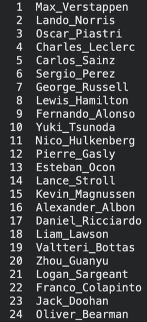
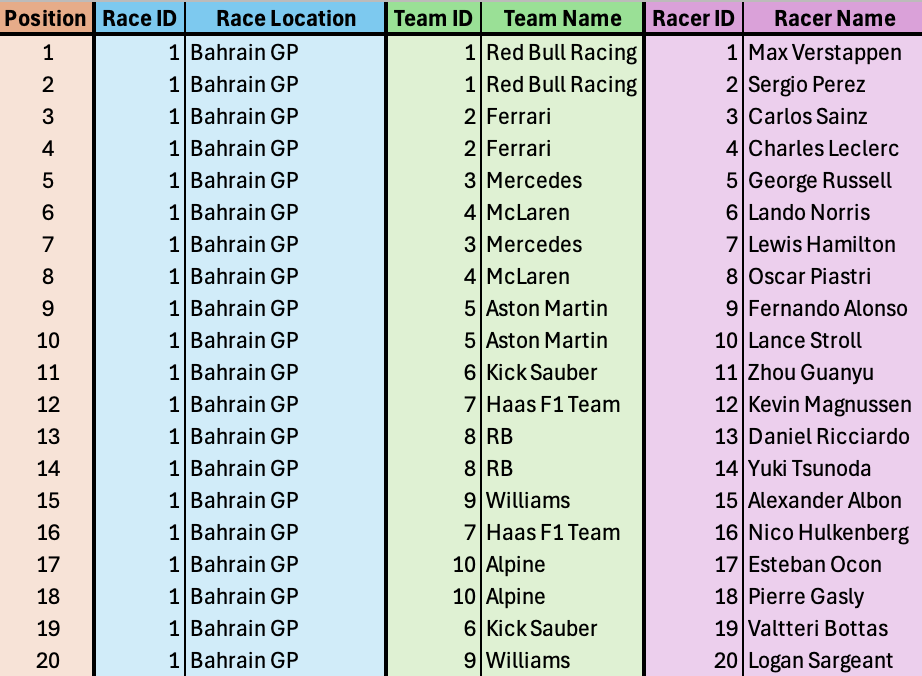

```{=html}
<style>
/* Header background image */
h1:first-of-type {
  background-image: url('F1_Cover_Image.png');
  background-size: cover;
  background-position: center;
  padding: 120px 20px;
  border-radius: 10px;
  color: #fff !important;
  text-shadow: 0 0 10px #000;
}

body { background: #000; color: #fff; }
section, h1, h2, h3, p, li, table, th, td { color: #fff; }
table { border-color: #444; }
th { background: #111; }
td { background: #222; }
/* Clean, modern spacing */
section { margin-top: 2.2rem; }
h1, h2, h3 { margin-top: 2.4rem !important; }

/* Table styling */
table { width: 100%; border-collapse: collapse; margin-top: 1rem; }
th, td { padding: 12px 16px; border-bottom: 1px solid #ddd; }
th { background: #f5f5f5; font-weight: 600; }
td { background: #fafafa; }

/* Image centering */
img { display: block; margin: 1.4rem auto; max-width: 90%; border-radius: 8px; }

/* Subtle dividers */
hr { margin: 2.4rem 0; border: 0; height: 1px; background: #e0e0e0; }

/* Paragraph readability */
p { line-height: 1.55; margin-bottom: 1rem; }
li { margin-bottom: 0.6rem; }
</style>
```

# Ranking F1 Performance: A Pairwise Ranking Approach for Drivers and Teams

## Project Summary & Skills Used

### Project Overview

This project applies Integer Linear Programming to solve a real-world sports ranking problem. We developed a two-stage optimization system to establish a comprehensive ranking of F1 drivers and their respective teams based on multi-race results, using a pairwise comparison model.

| Attribute | Details |
|:---|:---|
| **Teammate** | Sam Brogi |
| **Teammate ePortfolio:** | *https://sambrogi.quarto.pub/newproject/projects.html* |
| **My Name** | Mark Miner |
| **Core Concept** | Optimization Modeling (Integer Linear Programming), Data Synthesis |
| **Data Used** | Finishing positions ($P_{d,r}$) for the top F1 racers across 24 separate races. |

### Key Skills Used and Developed

-   **Operations Research:** Formulating and implementing a complex optimization model (Original and Extended).
-   **Programming & Solvers:** Implementing and solving the ILP models using AMPL/CPLEX.
-   **Data Handling:** Gathering, processing, and integrating real world data into model parameters.
-   **Analysis:** Interpreting optimized rankings and demonstrating the validity of the pairwise ranking method.

------------------------------------------------------------------------

## Project Development Process

### The Ranking Challenge

Our original goal was to objectively rank F1 drivers based on their performance consistency across multiple races, moving beyond simple point totals.

### Design Evolution (Model Extension)

After successfully solving the Original Driver Model, we extended the model to rank the F1 Teams themselves. This included introducing the parameter $A_{d,t}$ (TeamOf), which links each driver to their constructor. Extending the model added substantial value and required adapting the pairwise inversion logic to operate on driver-to-team relationships.

### Roadblocks and Solutions

-   **Data Synthesis:** A fully formatted dataset for all 24 races was not readily available. I gathered, cleaned, and synthesized the race result data directly from the F1 website (e.g., https://www.formula1.com/en/results/2024/drivers) to build the input parameters.
-   **Missing Race Data:** Not all drivers appear in all races due to substitutions. Our pairwise comparison structure naturally handled this variability by summing inversions ($\Sigma_{r\in R}$) only across the relevant races for each driver.

------------------------------------------------------------------------

## Key Features & Model Formulations

### 1. Original Driver Ranking Model

This ILP minimizes the total number of instances where a driver is ranked lower overall, but finished ahead of a higher-ranked driver in a specific race.

**Objective Function**:

$$
\min \sum_{r\in R}\sum_{i\in D}\sum_{j\in D}y_{r,i,j}
$$

**Sets**:

-   **R:** Set of races (1, 2, ..., 24)
-   **D:** Set of drivers
-   **K:** Set of possible final ranking positions ($K=\{1,2,...,|D|\}$)

**Parameters**:

-   $P_{d,r}$: Finishing position of driver $d$ in race $r$

**Decision Variables**:

-   $x_{d,k} \in \{0, 1\}$: 1 if driver $d$ is assigned rank $k$, 0 otherwise
-   $p_{d}$: Final rank assigned to driver $d$
-   $y_{r,i,j} \in \{0, 1\}$: 1 if driver $i$ finished ahead of driver $j$, 0 otherwise

**Constraints**:

1.  **Unique Rank Assignment (Driver):**\
    $$\sum_{k\in K}x_{d,k}=1 \quad \forall d \in D$$

2.  **Unique Rank Assignment (Rank):**\
    $$\sum_{d\in D}x_{d,k}=1 \quad \forall k \in K$$

3.  **Calculate Final Rank:**\
    $$p_{d}=\sum_{k\in K}k\cdot x_{d,k} \quad \forall d \in D$$

4.  **Pairwise Constraints:**\
    $$p_{i}+1\le p_{j}+M\cdot y_{r,i,j} \quad \forall r \in R, i, j \in D$$

------------------------------------------------------------------------

### **Final Driver Ranking Output**

Based on the optimized ILP solution, the top driver rankings are:

1.  **Max Verstappen**
2.  **Lando Norris**
3.  **Oscar Piastri**

Below is the visual output of the full ranking results:



------------------------------------------------------------------------

### 2. Extended Team Ranking Model

This extension applies the same minimization logic to rank the F1 teams, linking individual driver results to the overall team ranking.

**Objective Function**:

$$
\min \sum_{r\in R}\sum_{i\in D}\sum_{j\in D}y_{r,i,j}
$$

**Updated Sets & Parameters**:

-   **T:** Set of teams\
-   **K:** Set of possible final ranking positions for teams\
-   $A_{d,t}$: Assignment of driver $d$ to team $t$

**Updated Decision Variables**:

-   $x_{t,k} \in \{0, 1\}$: 1 if team $t$ is assigned rank $k$, 0 otherwise
-   $p_{t}$: Ranking assigned to team $t$

**Constraints**:

1.  **Unique Rank Assignment (Team):**\
    $$\sum_{k\in K}x_{t,k}=1 \quad \forall t \in T$$

2.  **Unique Rank Assignment (Rank):**\
    $$\sum_{t\in T}x_{t,k}=1 \quad \forall k \in K$$

3.  **Calculate Final Rank:**\
    $$p_{t}=\sum_{k\in K}k\cdot x_{t,k} \quad \forall t \in T$$

4.  **Pairwise Constraint:**\
    $$P(\text{team of racer } i)+1\le P(\text{team of racer } j)+M\cdot Y_{r,i,j}$$

------------------------------------------------------------------------

### 3. Data Insights and Optimized Results

-   **Raw Data Snapshot:**\
    A sample of the \*ynthesized race data (Bahrain GP) showing finishing positions, racer ID, and team ID.\
    

-   **Final Team Ranking Output:**\
    Final optimized rankings placed Red Bull (1st), McLaren (2nd), Ferrari (3rd).

------------------------------------------------------------------------

### 4. Key Takeaways

-   Pairwise comparison models provide accurate aggregated rankings across many races.\
-   Race-to-race variation reinforces the need for inversion-based aggregate metrics.

------------------------------------------------------------------------

## Reflection

### Individual Experience

Working on this project was a powerful way to connect theoretical optimization concepts to a real applied ranking problem.

-   **Learning & Growth:**\
    I strengthened my skills in understanding how optimization models function in practice. Handling the race data and seeing how it fed into the ILP helped me appreciate how much model performance depends on clean, consistent inputs.

-   **My Contribution:**\
    I led all the data collection, cleaning, and synthesis for the 24 races. Pulling results from the F1 website, standardizing them, and structuring the parameters gave me experience with preparing real-world data for optimization modeling.

-   **Teamwork and Debugging:**\
    Sam handled the model development and AMPL implementation, and most of our collaboration centered around validating pairwise constraints like\
    $p_{i}+1 \le p_{j}+M y_{r,i,j}$. The back-and-forth between the model logic and the data structure made the final ranking system more accurate and reliable.
