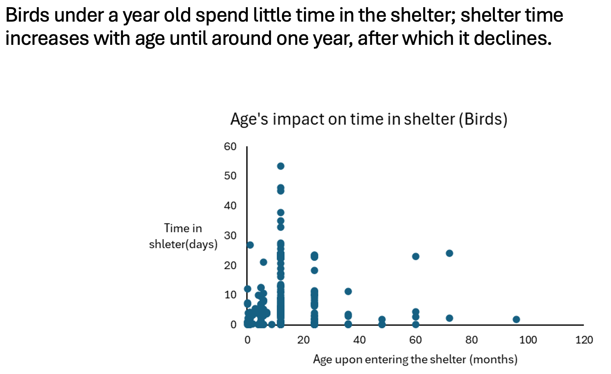
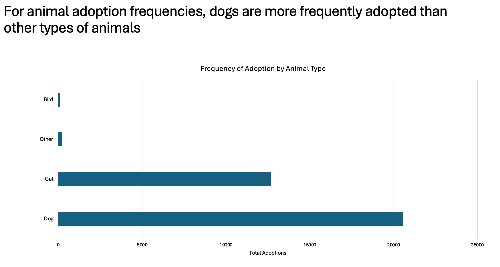
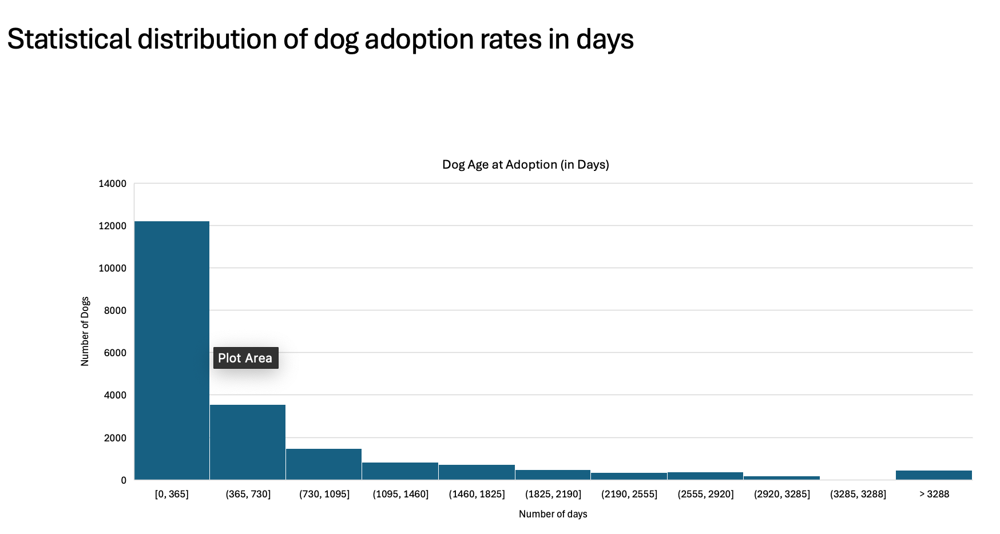
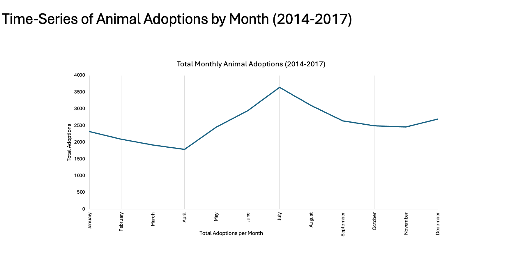

In this Intro to IE class assignment, I created four assertion-evidence slides based on analysis of data from the Austin Animal Center shelter. Each slide includes a graph created using good storytelling principles.

We chose a data set that included a variety of numerical and categorical data for each animal that checked in and/or checked out of the shelter. Each row in the data corresponded to one animal, and the columns included:

```         
•   age_upon_outcome\_(days) and age_upon_outcome\_(years) (numerical)

•   age_upon_outcome_age_group (categorical bin of age range)

•   animal_id_outcome and animal_id_intake (alphanumeric identifier)

•   date_of_birth, outcome_datetime, and intake_datetime (datetime)

•   outcome_subtype, outcome_type, intake_type, intake_condition (categorical)

•   sex_upon_outcome, sex_upon_intake (categorical)

•   animal_type, breed, color (categorical)

•   found_location (text/location string)

•   age_upon_intake\_(days) and age_upon_intake\_(years) (numerical)

•   age_upon_intake_age_group (categorical bin)

•   time_in_shelter_days (numerical)

•   time_in_shelter (duration/time delta)
```

Our group was asked to answer the question: Does bird age upon entering the shelter effect the time in days the spend in the shelter? This poses an interesting question because it could be thought about in multiple different ways for example someone might expect that the time in shelter for younger birds would be substantially less since owners want a bird that has its whole life left to live. Others might think that older birds will spend less time in the shelter since owners want a more mature bird that will take less attention to care for. To answer this question our group created a new column that converted the time upon entering the shelter (days) to time upon entering the shelter (months). This was done by dividing the age of the bird in days by 30.4167 since that is the average number of days in a month. After we created a pivot table that sorted the animal category to only show birds.



We created a scatter plot with age upon entering the shelter (months) as the horizontal axis and time in shelter (days) as the vertical axis. Our conclusion, Based on the scatter plot the time spent in the shelter increases until the bird reaches 12 moths of age, then begins to decrease as the bird gets older. We captured the conclusion in our assertion(see above).

Our group was asked to answer the question: How do the frequency of adoptions differ between dogs, cats, birds and other? This was interesting to us because there is always the argument between whether dogs or cats are better and with answering this question we can find out which is more popular. Our conclusion, based on the bar chart it can be observed that there is a substantially greater number of dogs adopted compared to cats.



We created a bar chart by making a filter to show the type of animals (dogs, cats, birds, and other) and the sum of how many times they were listed under the animal_type column in our data. The results imply that out of all animal types listed, dogs are the most commonly adopted animals from animal shelters. We captured the conclusion in our assertion(see above).

We looked at the distribution of dog ages at the time of adoption to understand whether people tend to adopt younger dogs more often, or if older dogs are just as likely to be chosen. This question is interesting because it can reveal public preferences and potential biases, which could help shelters improve how they market and care for dogs of different ages.  results showed a clear pattern. The most common age for adopted dogs was between 50 and 60 days. The number of adoptions was highest at the younger ages, peaked in that 50–60 day window, and steadily declined to near zero as the dogs got older. This suggests that people strongly prefer to adopt very young dogs, and that interest in adoption drops off significantly as dogs age.



We created a pivot table and filtered it so that only rows where outcome_type was Adoption and animal_type was Dog were included. For the rows, we used a column we created called Animal ID for Count, which assigned a unique identifier to each animal to make sure we didn’t count the same dog more than once. The values in the pivot table came from the sum of the age_upon_outcome\_(days) column, which matched each animal ID with its age at the time of adoption. This gave us a clean dataset of unique dog adoptions and their ages. We then used Excel’s histogram tool to build a custom histogram of the age distribution. We captured the conclusion in our assertion(see above).

Our group explored the question: is there a trend throughout the year showing a more popular time to adopt a pet? This is a compelling topic because it can help shelters better prepare for seasonal changes in adoption rates and plan resources accordingly. The final plot showed a clear seasonal trend. There was a noticeable spike in the summer, with June, July, and August standing out as the months with the most adoptions. This suggests that summer is the most popular time of year to adopt a pet.



We created a time series plot using a pivot table, and we filtered the pivot table so that it only included rows where the outcome_type was Adoption. We didn’t filter animal_type, so all types of animals were included in the data. In the pivot table, outcome_month was used for the rows, outcome_year for the columns, and we used a helper column called identity as the values, which assigned a value of 1 to each animal to make them countable. This gave us a breakdown of monthly adoptions by year. We excluded 2013 and 2018 since they weren’t full years and could introduce bias. We summed across the rows to get the total number of adoptions for each month across all complete years. Since the months were represented as numerical indices, we added a new column to convert those into actual month names, which we then used for the x-axis of the time series plot.We captured the conclusion in our assertion(see above).
